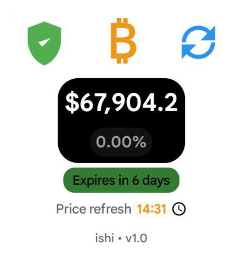
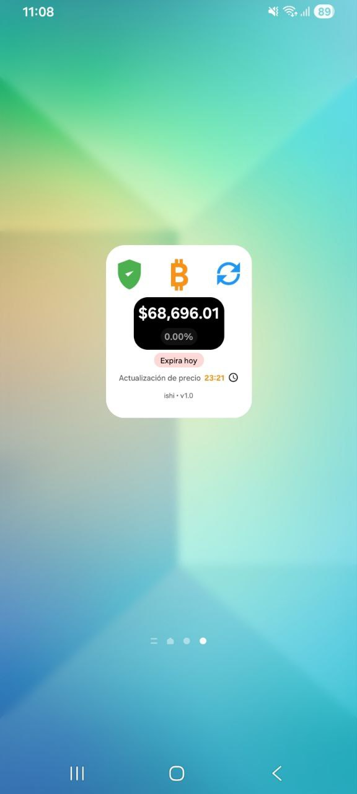
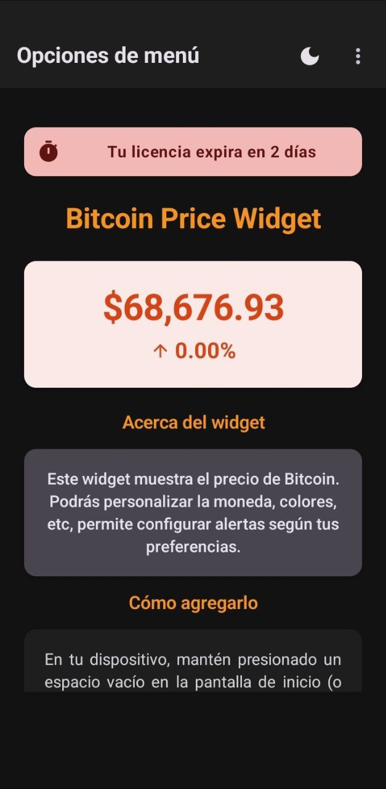
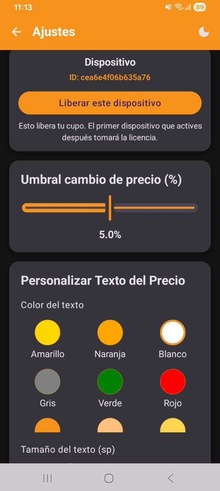
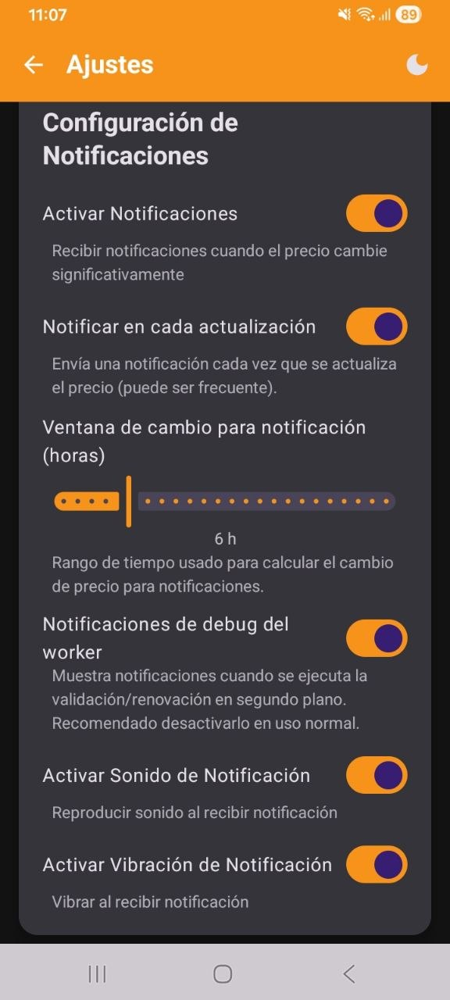
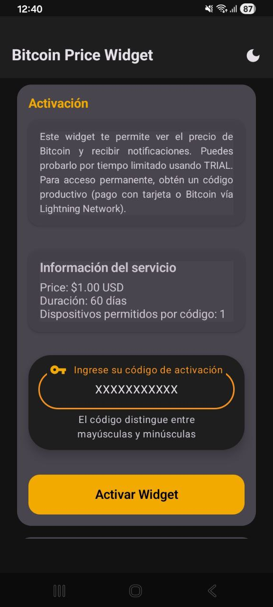

# Bitcoin Price Widget

Widget de Bitcoin para Android con actualizaciones programadas, alertas por cambio de precio y licenciamiento (TRIAL/PRO) controlado por servidor.



> Instalación por APK (GitHub/website). En algunos dispositivos verás un aviso de Google Play Protect (“App scan recommended”). Es normal cuando una app no viene desde Google Play.

## Capturas

| Widget | Pantalla principal |
|---|---|
|  |  |

| Ajustes | Notificaciones |
|---|---|
|  |  |

| Activación (TRIAL/PRO) | Play Protect (ejemplo) |
|---|---|
|  |  |

## Descarga

- **APK (Release):** ver la sección **Releases** del repositorio.
- **Checksums:** cada release incluye `SHA256SUMS` (SHA-256).

## Instalación rápida

1. Descarga el APK desde **Releases**.
2. (Opcional recomendado) Verifica el `SHA-256` del APK.
3. Abre el APK y acepta la instalación.
4. Si aparece **Google Play Protect**:
   - toca **Scan app** (recomendado), o
   - **Install without scanning** si confías en el checksum y el origen.

Guía completa: **docs/INSTALL.md**

## Verificar integridad (SHA-256)

Cada release incluye un archivo `SHA256SUMS`.

### Windows (PowerShell)

```powershell
$expected = (Get-Content .\SHA256SUMS).Split(' ')[0].ToLower()
$actual   = (Get-FileHash .\BitcoinPriceWidget-v1.0.0.apk -Algorithm SHA256).Hash.ToLower()
$expected -eq $actual
```

### Linux/macOS

```bash
sha256sum -c SHA256SUMS
```

Si el comando imprime `OK`, el APK coincide con el checksum publicado.

## Obtener PRO (código de activación)

La app funciona en **TRIAL** por tiempo limitado. Para desbloquear **PRO**:

1. Ve al sitio oficial: **https://www.widget.chiltota.xyz**
2. Elige el plan.
3. Paga con:
   - **Bitcoin (Lightning Network)**, o
   - **Tarjeta de crédito/débito**
4. Recibirás un **código PRO**.
5. En la app: **Activate** → pega el código → listo.

> Nota: el código PRO se asocia a tu dispositivo para prevenir abuso (ver **docs/SECURITY.md**).

## Qué incluye

- Precio BTC en pantalla de inicio (widget).
- Moneda y formato personalizable (incluye decimales opcionales).
- Intervalo de actualización configurable.
- Alertas por cambios de precio (umbral + ventana de tiempo).
- Notificaciones con sonido/vibración opcionales.
- Personalización de texto: tamaño del título, tamaño/color del precio, visibilidad de info.
- Estado de licencia (TRIAL/PRO) con expiración visible opcional.
- Modo claro/oscuro/sistema.

Lista completa: **docs/FEATURES.md**

## Privacidad

No se solicita email. Para licenciamiento se usa un identificador de dispositivo y metadatos básicos (modelo/OS) y la firma del APK para proteger el uso indebido.

Detalles: **docs/PRIVACY.md**

## Seguridad y confianza

- **APK firmado** y publicado en **Releases**.
- **Checksums SHA-256** por release (`SHA256SUMS`) para verificar integridad.
- La activación **TRIAL/PRO** está controlada por servidor para evitar reuso indebido del código.

Detalles: **docs/SECURITY.md**

## Soporte

- Preguntas frecuentes: **docs/FAQ.md**
- Problemas comunes: **docs/TROUBLESHOOTING.md**
- Reporte de bugs: abre un **Issue**.

---

## English

See **docs/INSTALL.md** and **docs/FEATURES.md** (English sections included).
